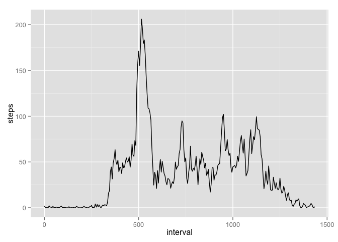
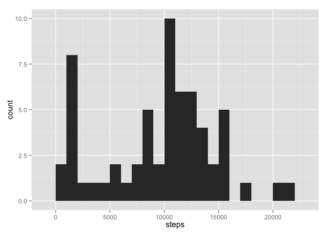
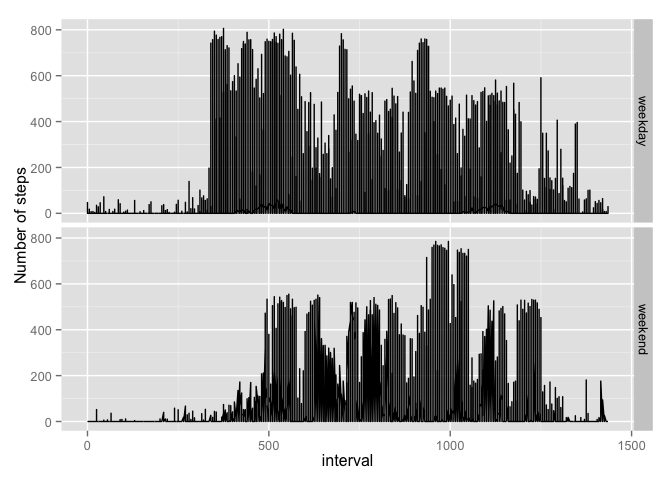

# Reproducible Research: Peer Assessment 1


## Loading and preprocessing the data

The data is preprocessed such that the interval column is changed to be minutes into the day, meaning the value will be between 0 and 1435. Originally the interval is of the form "%H%M", so without preprocessing there would be jumps e.g. going from 155 to 200.


```r
if (!file.exists("activity.csv")) {
  unzip("activity.zip")
}
act <- read.csv("activity.csv", colClasses=c("numeric", "Date", "character"))
act$interval <- sapply(act[,3], function(x) {
  if (nchar(x) < 3) {
      as.integer(x)
  } else if (nchar(x) == 3) {
      as.integer(substr(x, 1, 1)) * 60 + as.integer(substr(x, 2, 3))
  } else {
      as.integer(substr(x, 1, 2)) * 60 + as.integer(substr(x, 3, 4))
  }
  })
```

## What is mean total number of steps taken per day?

```r
library(ggplot2)
steps <- tapply(act$steps, act$date, sum)
qplot(steps, binwidth=1000)
```

 

```r
mean(steps, na.rm=TRUE)
```

```
## [1] 10766.19
```

```r
median(steps, na.rm=TRUE)
```

```
## [1] 10765
```


## What is the average daily activity pattern?

```r
s <- split(act, act$interval)
s2 <- lapply(s, function(x) {
  data.frame(steps=mean(x$steps, na.rm=TRUE), interval=x$interval[1])
})
avg_daily <- do.call("rbind", s2)
qplot(interval, steps, data=avg_daily, geom="line")
```

 

```r
max_int <- avg_daily$interval[which.max(avg_daily$steps)]
min2time <- function(x) {
  # Convert a "minutes since midnight" to hour:minute
  paste(as.character(floor(x/60)), ":", as.character(x%%60), sep="")
}
print(sprintf("Interval with maximum steps: %s - %s",
              min2time(max_int),
              min2time(max_int + 5)))
```

```
## [1] "Interval with maximum steps: 8:35 - 8:40"
```


## Imputing missing values

### Rows with missing values

```r
sum(rowSums(is.na(act)))
```

```
## [1] 2304
```

### Strategy for handling missing step values

I chose to use the median for that interval. This does not take into account day of week variations, but intuitively it at least seems better than taking the mean or median for that day. That is, the assumption is that the behavior is more correlated based on the time of day rather than within the day. I chose the median rather than the mean as the median is more robust with skewed distributionand outliers.


```r
s <- split(act, act$interval)
#median_daily <- list()
s2 <- lapply(s, function(x) {
  #data.frame(steps=median(x$steps, na.rm=TRUE), interval=x$interval[1])
  y <- list()
  y[[as.character(x$interval[1])]] <- median(x$steps, na.rm=TRUE)
})
median_daily <- do.call("c", s2)
act_fill <- act
for (i in 1:nrow(act_fill)) {
  if (is.na(act_fill$steps[i])) {
    act_fill$steps[i] <- median_daily[[as.character(act_fill$interval[i])]]
  }
}
steps <- tapply(act_fill$steps, act_fill$date, sum)
qplot(steps, binwidth=1000)
```

 

```r
mean(steps, na.rm=TRUE)
```

```
## [1] 9503.869
```

```r
median(steps, na.rm=TRUE)
```

```
## [1] 10395
```

One can see that replacing the missing values by the daily median pushes both the mean and median of the sum of daily steps lower. Most of this might be due to the peak that can be seen in the histogram at around 1000 steps, which isn't there in the original dataset containing NA's.

## Are there differences in activity patterns between weekdays and weekends?


```r
library(ggplot2)
#wd <- weekdays(act_fill$date)
#weekend <- wd == 'Sunday' | wd == 'Saturday'
act_fill$wd <- apply(act_fill, 1, function(x) {
  wd <- weekdays(as.Date(x[2]))
  if (wd == 'Sunday' | wd == 'Saturday') {
    "weekend"
  } else {
    "weekday"
  }
})
act_fill$wd <- as.factor(act_fill$wd)
qplot(interval, steps, data=act_fill, facets= wd ~., geom="line",
      ylab="Number of steps")
```

 

One can see that on weekends, there is less activity, and the activity is shifted towards the evening, whereas on weekdays the highest activity occurs in the morning, presumably when people are going to work/school/whatever.
